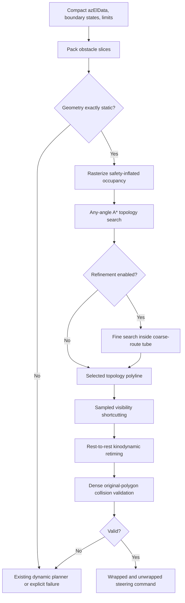

# Autonomous Static-Corridor Planning for Azimuth-Elevation Steering

**Any-angle topology discovery, local corridor refinement, and
rate/acceleration-constrained retiming**

Technical white paper, version 1.0<br>
27 July 2026<br>
OREKIT MATLAB Upgrade Project

## Abstract

This paper presents an autonomous planner for steering a sensor boresight
through difficult static forbidden regions in azimuth-elevation coordinates.
The planner was developed for cases in which a direct search over position,
rate, acceleration, and time spends most of its effort discovering basic
topology: for example, determining that a route must wind through a spiral,
alternate through a slalom, or first move away from a goal to escape a
cul-de-sac.

The method separates geometric route discovery from dynamic retiming. It
first proves that every obstacle slice is identical over the maneuver
interval, rasterizes the safety-inflated forbidden set once, and applies an
eight-neighbor A* search with Theta-style parent line-of-sight relaxation.
An optional finer search is restricted to a tube around the coarse route.
The resulting polyline is greedily shortened using sampled visibility
against the original packed polygons, then retimed with synchronized
rest-to-rest triangular or trapezoidal profiles that satisfy independent
azimuth and elevation rate and acceleration limits. A denser internal
collision profile is checked before any result is returned.

The planner requires no guide path or homotopy label. In the standalone
five-turn spiral, it autonomously produced a 241.860 degree route with zero
occupied output samples. In a four-barrier slalom, correcting a fixed-horizon
minimum-time objective to minimum angular distance reduced the route from
approximately 58.34 to 33.98 degrees. A static demonstration using 500
retained boundary vertices each for Vietnam and China produced a 138.111
degree route with zero occupied samples in 7.6-10.1 seconds of wall time
across two development runs.

The method is complete on its finite eight-connected occupancy graph when
run without resource interruption, but it is not a continuous-space global
optimizer. Any-angle parent relaxation, rasterization, sampled visibility,
and sampled collision validation are deliberate engineering approximations.
The returned endpoint-distance ratio is a useful lower-bound certificate
within the sampled collision model, not a proof of exact continuous
optimality.

## 1. Motivation

The boresight planning problem has two coupled forms of difficulty:

1. **Topology:** Which side of each forbidden region should the path take?
2. **Dynamics:** Can that geometric path be traversed within the available
   time while respecting rate and acceleration limits?

A direct kinodynamic lattice can answer both questions at once. Its state,
however, contains at least azimuth, elevation, azimuth rate, elevation rate,
and time. A fine search over that state space is expensive, particularly in
long spirals and nested barriers where many dynamically distinct states
represent the same topological mistake. This simultaneous enforcement of
kinematic and dynamic constraints is the defining kinodynamic planning
problem [9].

The autonomous corridor planner exploits a narrower but important operating
regime: obstacle geometry is static over the maneuver interval, terminal
time is fixed, boundary rate and acceleration are zero, and path length is
the objective. In that regime, route topology can be solved once in a
two-dimensional configuration space and dynamics can be imposed afterward.

This decomposition follows the general configuration-space view of motion
planning [1], uses heuristic graph search originating with A* [2], and adopts
the any-angle parent-relaxation idea introduced by Theta* [3,4]. The final
retiming stage is intentionally simpler than general time-optimal path
parameterization [5,6]: every retained corner is a rest point. That
restriction makes feasibility transparent and maintainable.

## 2. Problem Statement

### 2.1 Configuration

Let

```text
q(t) = [a(t), e(t)]^T
```

denote azimuth and elevation in degrees. The configuration domain is

```text
C = [a_min, a_max] x [e_min, e_max].
```

When azimuth wrapping is enabled, the azimuth interval spans exactly 360
degrees and its endpoints are identified. Elevation is bounded and does not
wrap.

The start and stop states are

```text
x_0 = [q_0, v_0, u_0, t_0]
x_f = [q_f, v_f, u_f, t_f].
```

The autonomous method currently requires

```text
v_0 = v_f = 0
u_0 = u_f = 0
t_f > t_0.
```

Requests outside this subset can be delegated to the existing planner.

### 2.2 Steering model

The retimer treats each axis as a double integrator:

```text
q_dot(t) = v(t)
v_dot(t) = u(t).
```

Componentwise limits are

```text
|v_i(t)| <= v_max,i
|u_i(t)| <= u_max,i.
```

The present model does not constrain jerk, flexible modes, actuator torque,
mount singularities, or coupled vehicle/sensor dynamics.

### 2.3 Forbidden regions

Each input obstacle contains a polygonal az/el boundary at every sampled
time. For the autonomous method to run, each obstacle must:

- cover the complete interval `[t_0, t_f]`;
- have the same retained vertex count in every slice; and
- have exactly equal packed azimuth and elevation vertices in every slice.

For obstacle `j`, let `O_j` denote that static polygon and let `rho` be
`SafetyMargin_deg`. The planning obstacle is the Euclidean expansion

```text
O_j^rho = {q in C : distance(q, O_j) <= rho}.
```

All obstacles are combined as a union. This is a point-planning
configuration-space model: any finite sensor footprint, pointing
uncertainty, or tracking error must be represented through the margin or an
already-expanded input boundary.

### 2.4 Objective

The geometric objective is flat azimuth-elevation path length:

```text
             1
L[gamma] = integral ||gamma'(s)||_2 ds.
             0
```

With azimuth wrapping, displacement uses the shortest equivalent azimuth
difference. This metric is convenient for gimbal-coordinate planning, but it
is not the spherical angle traversed by a physical unit boresight. At high
elevation, a degree of azimuth corresponds to less physical rotation than it
does near the horizon.

The terminal time remains a feasibility constraint rather than the
optimization cost. If a route finishes early, the returned command waits at
the goal until `t_f`.

## 3. Method Overview



The implementation is deterministic for fixed numeric inputs and options.
It uses no learned model, random sampling, or caller-supplied route.

## 4. Static-Geometry Certification

`workspaceIsStatic` compares the packed representation rather than trusting
a status label or sampling only a few times. For every obstacle:

1. The first and last stored times must cover the requested interval.
2. Every slice must contain the same number of retained vertices.
3. Every packed azimuth array must be exactly equal to the first slice.
4. Every packed elevation array must be exactly equal to the first slice.

This test is intentionally strict. Even a numerically small motion routes the
request away from the autonomous static method. That choice prevents a
moving obstacle from being accidentally frozen at one time.

The certification occurs after optional boundary reduction in
`buildAzElTimeObstacleWorkspace`. Therefore "static" means static in the
retained planning representation.

## 5. Safety-Inflated Occupancy Raster

### 5.1 Grid construction

The base grid is defined by `TopologyGridStep_deg`.

- A nonwrapped azimuth grid includes both configured limits.
- A wrapped grid uses `ceil(360 / step)` bins and slightly adjusts the
  realized step so the bins divide the periodic domain exactly.
- The elevation grid includes both elevation limits.

Each grid point is queried against the packed polygons using polygon mode
and the requested safety margin. Start and stop are also queried at their
exact continuous coordinates before snapping to grid nodes.

### 5.2 Modeling interpretation

Occupancy is stored at grid vertices, not as a conservative cell covering.
A polygon thinner than the grid spacing can therefore lie between free grid
vertices. The later original-polygon collision check is essential; the
raster alone is not a safety certificate.

Reducing `TopologyGridStep_deg` improves geometric resolution but increases
the number of grid nodes approximately quadratically. Increasing
`SafetyMargin_deg` compensates for model uncertainty but can remove narrow
corridors.

## 6. Any-Angle Topology Search

### 6.1 Base graph

`searchAzElAnyAngleAStar` expands an eight-neighbor grid. Diagonal moves are
rejected when either orthogonally adjacent grid point is occupied, preventing
a diagonal from cutting through a blocked corner. Wrapped azimuth neighbors
connect across the first and last columns.

The accumulated and heuristic costs use wrapped Euclidean distance:

```text
g(n) = path length from start to n
h(n) = wrapped Euclidean distance from n to goal
f(n) = g(n) + w h(n),
```

where `w = TopologyHeuristicWeight` and the default is one. Closed nodes are
reopened whenever a shorter parent is discovered.

### 6.2 Theta-style parent relaxation

Ordinary grid A* constrains every path segment to a grid edge. The new search
also asks whether the current node's parent has raster line of sight to a
candidate neighbor. If so, it evaluates

```text
g(parent(current)) + distance(parent(current), neighbor)
```

instead of forcing the route through `current`. This is the central
Theta-style relaxation [3,4]. It removes much of the heading quantization of
an eight-neighbor grid without constructing a full visibility graph.

The implementation samples raster line of sight at four substeps per
dominant grid-index increment. The result is an any-angle polyline with
fewer corners, but not a proof of the shortest continuous path. Basic Theta*
itself is known to find short paths without guaranteeing the true shortest
any-angle path [4].

### 6.3 Search behavior

The Euclidean heuristic is admissible for the explicit eight-neighbor graph
when `w = 1`. The parent-relaxation implementation retains ordinary adjacent
edges, so a connected finite grid remains discoverable even when no
long-range relaxation succeeds. Resource limits can still terminate search
before a route is found.

When `w > 1`, the search becomes more goal-directed. The implementation does
not publish a weighted suboptimality theorem for the resulting Theta-style
search, so `w = 1` should be used when route quality is more important than
expansion count. The broader relationship between heuristic weighting and
search effort dates to Pohl [7].

## 7. Corridor-Constrained Refinement

The optional refinement stage addresses a common cost problem: a uniformly
fine global grid is expensive even when only a narrow region around a coarse
solution matters.

The refiner:

1. Creates a grid with `RefinementGridStep_deg`.
2. Computes each fine point's distance to the coarse polyline.
3. Marks points outside `RefinementCorridorHalfWidth_deg` as unavailable.
4. Queries the original inflated polygons only for candidate points inside
   the tube.
5. Runs another unweighted any-angle search inside the restricted region.
6. Keeps the refined path only when it is shorter.

This procedure usually preserves the selected route family and avoids
polygon queries over unrelated parts of the domain. It is best described as
corridor-constrained refinement, not a formal homotopy proof: a wide or
self-overlapping tube can contain more than one topological alternative.

The current implementation allocates coordinate arrays for the full fine
grid even though polygon queries are restricted to the tube. Its collision
work is local, but its peak coordinate-array memory is still proportional to
the full fine grid. Wrapped-azimuth refinement is currently deferred.

## 8. Sampled Visibility Reduction

Grid and any-angle searches can retain corners that are unnecessary when
tested against the original polygon geometry. Starting from each retained
point, `simplifyAzElRouteVisibility` attempts progressively farther route
points. It accepts the farthest consecutively visible point and repeats.

Each candidate chord is sampled at spacing no larger than
`RouteShortcutStep_deg`, wrapped when required, and queried in polygon mode
with the safety margin. The algorithm stops extending a chord after the
first blocked candidate. This greedy rule is fast and deterministic, but it
can miss a farther visible chord in a nonmonotone geometry.

The phrase "visibility" here means sampled visibility against the original
packed polygons. It is more accurate than raster-only smoothing, but it is
not an analytic segment-polygon intersection certificate.

## 9. Kinodynamic Retiming

### 9.1 Segment parameterization

After shortcutting, each segment has displacement

```text
d = [Delta_a, Delta_e]^T.
```

The segment follows one scalar progress variable:

```text
q(t) = q_start + s(t)d,
0 <= s(t) <= 1.
```

Per-axis constraints imply scalar limits

```text
V = min_i(v_max,i / |d_i|)
A = min_i(u_max,i / |d_i|),
```

where zero-displacement axes are omitted.

### 9.2 Triangular and trapezoidal profiles

If the velocity limit is not reached, the segment uses a symmetric
triangular profile:

```text
t_acc  = sqrt(1/A)
v_peak = sqrt(A)
T      = 2 t_acc.
```

Otherwise it uses a trapezoid:

```text
t_acc    = V/A
v_peak   = V
t_cruise = (1 - V^2/A)/V
T        = 2 t_acc + t_cruise.
```

Because both axes share `s(t)`, their motion is synchronized. Every retained
waypoint is reached at zero velocity before the next segment begins.

If the sum of minimum segment durations exceeds `t_f - t_0`, retiming fails.
Otherwise the planner tests up to 100 uniformly spaced choices for placing
the complete maneuver inside the available slack. Static obstacles make
these choices geometrically equivalent, but the mechanism is shared with
the guided-route implementation.

Stopping at corners avoids an instantaneous velocity-direction change. It
also lengthens maneuver time compared with continuous-curvature or blended
retiming. General path-parameterization methods can traverse smooth paths
without stopping [5,6]; they are a logical future extension.

## 10. Final Collision Validation

The public output uses `SampleTime_s`. Collision validation may use a denser
profile:

```text
Delta_t_check = min(
    SampleTime_s,
    TopologyGridStep_deg / (2 max(v_max))
).
```

At maximum speed, this limits nominal travel between checks to roughly half
a topology-grid step. Every dense sample is queried against the original
packed polygon representation with:

- polygon collision mode;
- `SafetyMargin_deg`; and
- one adjacent obstacle time slice on each side.

For a certified static workspace, adjacent time slices contain the same
geometry. The time-padding behavior remains useful because the retimer and
fallback planner share collision semantics.

A successful result therefore establishes collision freedom at every
internal check sample, not for every continuous instant. Safety-critical use
must select a check interval and margin from a bound on relative obstacle and
boresight motion, or replace sampled checks with conservative swept-volume
or interval methods.

## 11. Dispatch and Fallback

The autonomous method is bypassed when any of the following is true:

- the objective is not `minimumAngularDistance`;
- any boundary velocity or acceleration is nonzero;
- any obstacle changes geometry over the maneuver interval;
- topology search fails or exceeds its resource limits; or
- the discovered route cannot be retimed and validated.

With `FallbackToExistingPlanner = true`, the request is passed to
`planAzElAvoidance`. With the option set to false, the function returns an
explicit failure. Tests and benchmarks use false when they must prove that
the autonomous route was genuinely discovered by the new method.

The physical Vietnam example illustrates the intended division of labor.
Its Orekit-projected az/el polygon moves with time, so the dynamic
kinodynamic A* planner handles it. On the development machine, that example
returned a successful 35 second trajectory with 918 expanded nodes and eight
path nodes in approximately 14.3 seconds of wall time.

## 12. Correctness and Optimality Claims

### 12.1 Claims the implementation supports

1. **Static input is verified.** All retained polygon slices are compared
   exactly over the requested time interval.
2. **Finite-graph completeness.** Without wall-time or expansion
   interruption, the ordinary adjacent edges make the search complete on the
   connected finite occupancy graph.
3. **Endpoint and sampled-path validity.** Exact endpoints and every dense
   trajectory sample clear the retained polygons by the requested sampled
   margin.
4. **Analytic segment dynamics.** The generated triangular or trapezoidal
   segment profiles satisfy the configured per-axis rate and acceleration
   magnitude limits by construction.
5. **Continuous azimuth representation.** Wrapped output is accompanied by
   an unwrapped azimuth history suitable for steering and differentiation.
6. **A posteriori lower-bound ratio.** Let `L` be returned path length and
   let

   ```text
   L_lb = wrapped Euclidean distance(q_0, q_f).
   ```

   Every continuous path between the endpoints has length at least `L_lb`.
   Thus `L/L_lb` bounds the returned route relative to the unknown continuous
   optimum, provided the returned route is considered feasible under the
   same sampled collision model.

### 12.2 Claims the implementation does not make

- It does not prove the shortest continuous collision-free path.
- It does not prove Theta-style search optimality over all any-angle routes.
- It does not guarantee collision freedom between sampled checks.
- It does not prove that refinement preserves homotopy for every tube.
- It does not minimize maneuver time when terminal time is fixed.
- It does not enforce jerk, torque, structural, thermal, or line-of-sight
  uncertainty constraints.
- It does not make the flat az/el metric equivalent to physical boresight
  rotation.

These distinctions are important. A short, visually convincing path is
evidence of good performance, not a mathematical global-optimality proof.

## 13. Complexity

Let:

```text
N_a = number of azimuth grid values
N_e = number of elevation grid values
N   = N_a N_e
E_p = number of retained polygon edges
M   = number of topology waypoints
Q   = number of dense trajectory samples.
```

### 13.1 Base raster and search

- Grid coordinate storage is `O(N)`.
- Occupancy rasterization issues `N` polygon queries; packed bounds reduce
  the number of edges reaching the narrow phase.
- Graph state, parents, scores, closed flags, and heap storage are `O(N)`.
- Ordinary A* heap operations contribute `O(N log N)` in the worst finite
  graph case.
- Theta-style raster line-of-sight adds work proportional to the number of
  sampled grid indices on each attempted parent relaxation.

The practical cost is governed by obstacle coverage, heuristic guidance,
and line-of-sight length rather than only by `N`.

### 13.2 Refinement

For a full fine grid of `N_f` points and `N_c` points inside the corridor:

- coordinate and distance arrays use `O(N_f)` memory;
- polygon queries are restricted to `O(N_c)` points; and
- the restricted search remains `O(N_f)` in allocated graph arrays in the
  current implementation.

### 13.3 Shortcutting and retiming

Greedy shortcutting performs at most `O(M^2)` candidate chord checks. Each
check samples in proportion to chord length divided by
`RouteShortcutStep_deg`.

Retiming is linear in the number of retained segments. Collision validation
is approximately `O(Q)` broad-phase queries plus the packed narrow-phase
edge work. Up to 100 motion-start candidates can be tested when slack is
available.

## 14. Experimental Evaluation

### 14.1 Environment and interpretation

The following figures are representative development measurements from
MATLAB on a Windows desktop on 27 July 2026. Runtime varies with MATLAB/JVM
warm state and machine load. Every reported route was rechecked with
`queryAzElTimeObstacle`, and the test examples asserted zero occupied output
samples.

The experiments are deterministic scenario tests, not a statistically
powered benchmark campaign.

### 14.2 Five-turn spiral

The spiral input is generated directly as static `azElData`. The planner:

- receives no `GuidePath_deg`;
- has fallback disabled;
- uses a 0.5 degree topology grid and 0.5 degree safety margin;
- discovers the winding direction autonomously; and
- retimes the route under the configured limits.

Representative result:

| Metric | Result |
|---|---:|
| Angular route | 241.860 deg |
| Net polar winding | 4.06 turns |
| Motion completion | 127.0 s |
| Observed planner time | 4.9-6.3 s |
| Observed topology-search time | 2.0-2.5 s |
| Occupied output samples | 0 |

The obstacle centerline contains five turns, while the shortest legal route
enters at the outer opening and rounds the inner tip. Its net endpoint
winding is therefore slightly above four turns rather than exactly five.

### 14.3 Alternating slalom

Four static barriers require alternating positive and negative elevation
crossings. The earlier example used a `minimumTime` objective while fixing
arrival at 60 seconds. Every feasible route therefore had the same reported
time cost, and tie ordering selected a valid but unnecessarily long path.

The corrected example uses `minimumAngularDistance`, a 0.25 degree topology
grid, and the autonomous planner with fallback disabled.

| Metric | Earlier fixed-time route | Autonomous distance route |
|---|---:|---:|
| Angular route | about 58.34 deg | 33.982 deg |
| Observed search time | about 1.5-2.3 s | 1.38-2.22 s |
| Crossing elevations | wide detours | `[1.5, -1.5, 1.5, -1.5]` deg |
| Occupied output samples | 0 | 0 |

The route-length reduction is approximately 41.7 percent. This comparison
demonstrates objective alignment, not a general claim that the autonomous
planner always outperforms the dynamic lattice.

### 14.4 Vietnam and China static boundary demonstration

The standalone demonstration loads ADM0 boundaries from geoBoundaries [8].
Each country is capped at 500 retained vertices and mapped by

```text
azimuth = longitude - 110 deg
elevation = latitude.
```

This translation preserves the recognizable outlines for a standalone
geometry benchmark but is not a physical satellite sensor projection.

| Metric | Result |
|---|---:|
| Obstacles | Vietnam and China |
| Retained vertices | 500 per country |
| Angular route | 138.111 deg |
| Endpoint lower bound | 136.015 deg |
| Lower-bound ratio | 1.015 |
| Expanded topology nodes | 1,992 |
| Representative planner search time | 4.80 s |
| Observed total example wall time | 7.56-10.12 s |
| Occupied output samples | 0 |

The 1.015 ratio means the returned feasible route is no more than 1.5 percent
longer than the unknown optimum under the flat path-length objective and the
sampled collision model. It does not prove that the route itself is the
continuous optimum.

### 14.5 Automated regression coverage

`testAzElAutonomousCorridor` contains four focused tests:

1. Autonomous five-turn spiral with no guide path
2. Short wrapped-azimuth seam route
3. Explicit dynamic-geometry fallback
4. Optional narrow-tube refinement

The generated gauntlet adds stop-go timing, wrapped seam detour, alternating
slalom, and U-trap escape cases. At publication, all four focused tests and
all five gauntlets passed, and MATLAB Code Analyzer reported zero findings
across the standalone MATLAB files.

## 15. Operational Guidance

1. Use `planAzElAutonomousCorridor` only when obstacle slices are expected to
   be static. Leave fallback enabled in mixed workloads.
2. Set `FallbackToExistingPlanner = false` in validation tests that must
   prove the autonomous method ran.
3. Begin with a topology grid near the smallest corridor scale that matters.
   Halving the step can increase grid size by roughly four.
4. Use a safety margin that accounts for boundary reduction, pointing error,
   timing error, and tracking error.
5. Keep `TopologyHeuristicWeight = 1` when route quality and finite-graph
   search behavior matter more than aggressive goal bias.
6. Enable refinement only when the coarse route is feasible but angular
   length warrants more computation.
7. Select `RouteShortcutStep_deg` and the dense collision interval from the
   thinnest relevant obstacle and maximum slew rate.
8. Inspect `plan.method`, `plan.fallbackReason`,
   `plan.angularPathLength_deg`, `plan.angularLowerBound_deg`, and
   `plan.suboptimalityBound`.
9. Independently validate commands at higher temporal and geometric
   resolution before operational use.
10. Apply the real mount transform and actuator model before treating az/el
    coordinates as hardware commands.

## 16. Limitations and Future Work

The most valuable next developments are:

- analytic or conservative segment-polygon collision certificates;
- swept obstacle regions between time samples;
- sparse corridor data structures that avoid allocating the full fine grid;
- wrapped-azimuth corridor refinement;
- curvature-continuous path smoothing with obstacle-aware validation;
- jerk-limited retiming with nonzero boundary states;
- continuous-velocity passage through blended corners;
- spherical or actuator-space path metrics;
- branch-and-bound over topological alternatives;
- visibility-graph or subgoal-graph comparison for polygonal workspaces;
- automatic grid adaptation near narrow passages; and
- a benchmark corpus with repeated runtime distributions and known optima.

The architecture intentionally keeps these concerns separated. A future
topology solver can replace the any-angle grid search without changing the
packed obstacle API, while a future retimer can replace rest-to-rest segments
without changing route discovery.

## 17. Implementation Map

| Responsibility | Source |
|---|---|
| Public autonomous planner and dispatch | [`standalone/azElAvoidance/planAzElAutonomousCorridor.m`](../standalone/azElAvoidance/planAzElAutonomousCorridor.m) |
| Any-angle grid search | [`standalone/azElAvoidance/private/searchAzElAnyAngleAStar.m`](../standalone/azElAvoidance/private/searchAzElAnyAngleAStar.m) |
| Corridor refinement | [`standalone/azElAvoidance/private/refineAzElTopologyCorridor.m`](../standalone/azElAvoidance/private/refineAzElTopologyCorridor.m) |
| Visibility reduction | [`standalone/azElAvoidance/private/simplifyAzElRouteVisibility.m`](../standalone/azElAvoidance/private/simplifyAzElRouteVisibility.m) |
| Rate/acceleration retiming | [`standalone/azElAvoidance/private/planAzElGuidedRoute.m`](../standalone/azElAvoidance/private/planAzElGuidedRoute.m) |
| Packed obstacle workspace | [`standalone/azElAvoidance/buildAzElTimeObstacleWorkspace.m`](../standalone/azElAvoidance/buildAzElTimeObstacleWorkspace.m) |
| Collision query | [`standalone/azElAvoidance/queryAzElTimeObstacle.m`](../standalone/azElAvoidance/queryAzElTimeObstacle.m) |
| Focused tests | [`standalone/azElAvoidance/tests/testAzElAutonomousCorridor.m`](../standalone/azElAvoidance/tests/testAzElAutonomousCorridor.m) |
| Generated gauntlets | [`standalone/azElAvoidance/examples/runStaticGauntletExamples.m`](../standalone/azElAvoidance/examples/runStaticGauntletExamples.m) |
| Short implementation guide | [`standalone/azElAvoidance/docs/AUTONOMOUS_PLANNER.md`](../standalone/azElAvoidance/docs/AUTONOMOUS_PLANNER.md) |

## References

[1] T. Lozano-Perez, "Spatial Planning: A Configuration Space Approach,"
*IEEE Transactions on Computers*, vol. C-32, no. 2, pp. 108-120, 1983.
[doi:10.1109/TC.1983.1676196](https://doi.org/10.1109/TC.1983.1676196)

[2] P. E. Hart, N. J. Nilsson, and B. Raphael, "A Formal Basis for the
Heuristic Determination of Minimum Cost Paths," *IEEE Transactions on
Systems Science and Cybernetics*, vol. 4, no. 2, pp. 100-107, 1968.
[doi:10.1109/TSSC.1968.300136](https://doi.org/10.1109/TSSC.1968.300136)

[3] A. Nash, K. Daniel, S. Koenig, and A. Felner, "Theta*: Any-Angle Path
Planning on Grids," *Proceedings of the Twenty-Second AAAI Conference on
Artificial Intelligence*, pp. 1177-1183, 2007.
[AAAI publication page](https://ocs.aaai.org/Library/AAAI/2007/aaai07-187.php)

[4] K. Daniel, A. Nash, S. Koenig, and A. Felner, "Theta*: Any-Angle Path
Planning on Grids," *Journal of Artificial Intelligence Research*, vol. 39,
pp. 533-579, 2010.
[JAIR volume record](https://auld.aaai.org/Press/Journals/jairvol39.php)

[5] J. E. Bobrow, S. Dubowsky, and J. S. Gibson, "Time-Optimal Control of
Robotic Manipulators Along Specified Paths," *The International Journal of
Robotics Research*, vol. 4, no. 3, pp. 3-17, 1985.
[doi:10.1177/027836498500400301](https://doi.org/10.1177/027836498500400301)

[6] T. Kunz and M. Stilman, "Time-Optimal Trajectory Generation for Path
Following with Bounded Acceleration and Velocity," *Proceedings of Robotics:
Science and Systems VIII*, 2012.
[doi:10.15607/RSS.2012.VIII.027](https://doi.org/10.15607/RSS.2012.VIII.027)

[7] I. Pohl, "Heuristic Search Viewed as Path Finding in a Graph,"
*Artificial Intelligence*, vol. 1, nos. 3-4, pp. 193-204, 1970.
[doi:10.1016/0004-3702(70)90007-X](https://doi.org/10.1016/0004-3702(70)90007-X)

[8] D. Runfola et al., "geoBoundaries: A Global Database of Political
Administrative Boundaries," *PLOS ONE*, vol. 15, no. 4, e0231866, 2020.
[doi:10.1371/journal.pone.0231866](https://doi.org/10.1371/journal.pone.0231866)

[9] B. Donald, P. Xavier, J. Canny, and J. Reif, "Kinodynamic Motion
Planning," *Journal of the ACM*, vol. 40, no. 5, pp. 1048-1066, 1993.
[doi:10.1145/174147.174150](https://doi.org/10.1145/174147.174150)
