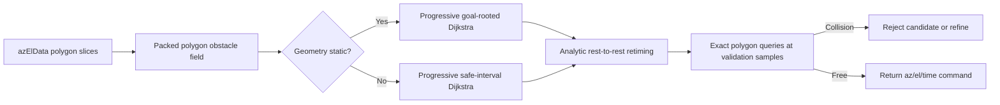
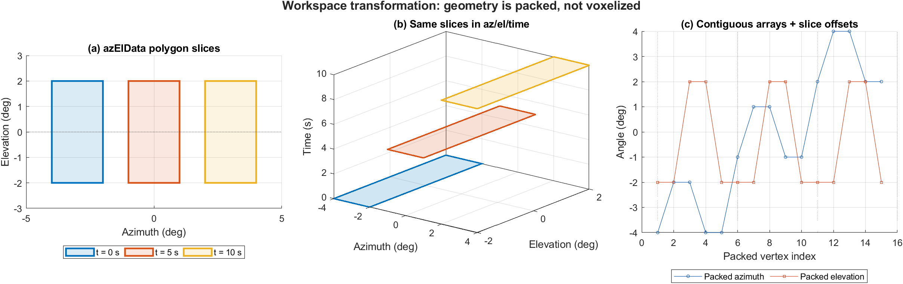
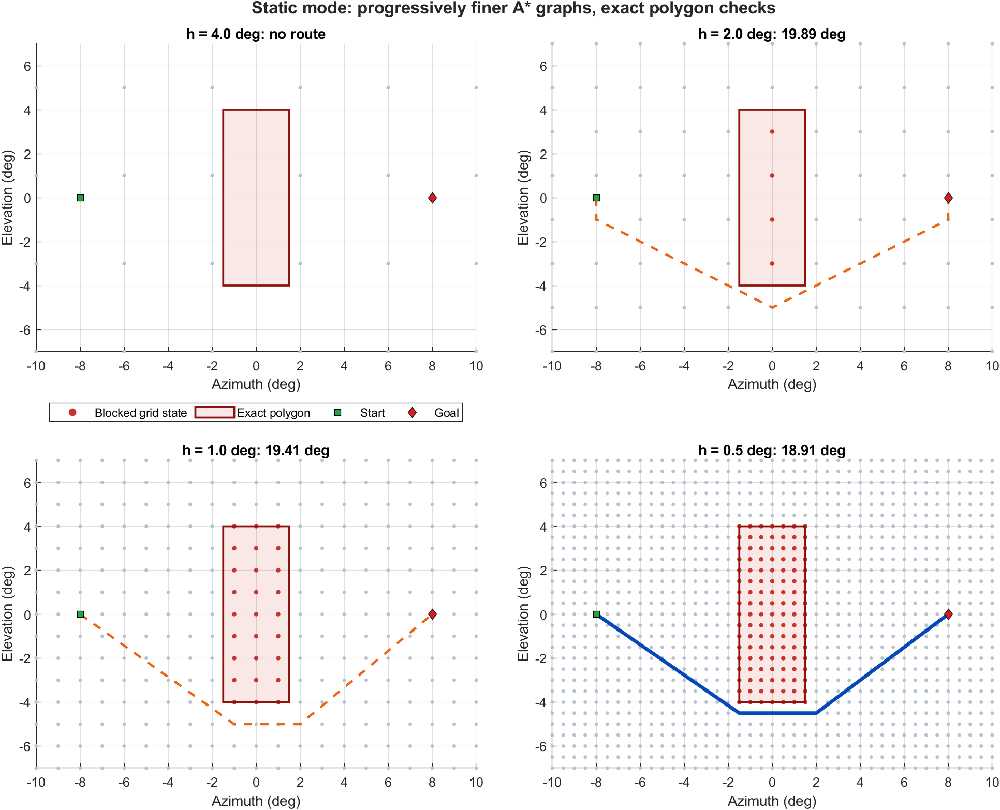
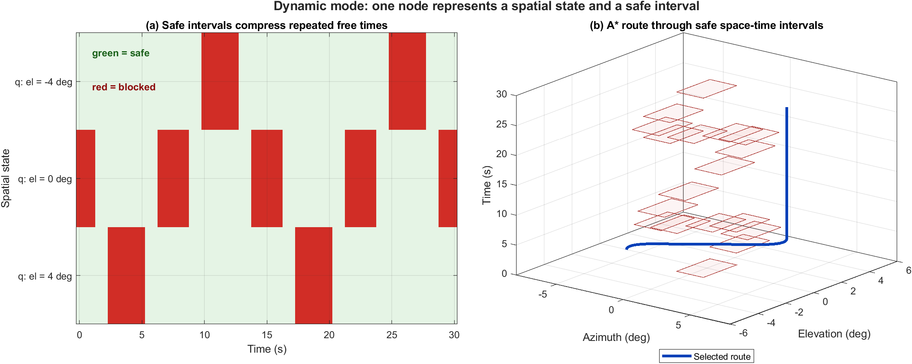
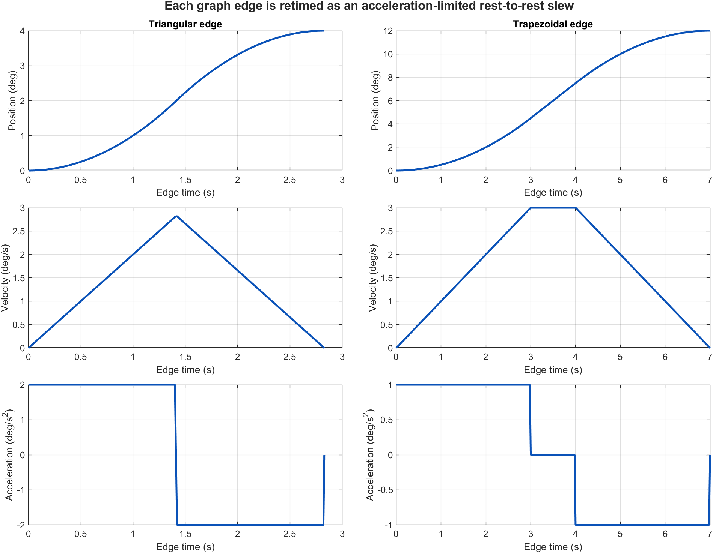

# Plan Az/El Dijkstra: Technical Guide

## Purpose and audience

This guide explains how `planAzElDijkstra` converts moving forbidden
regions in azimuth/elevation coordinates into a route for a rate- and
acceleration-limited boresight. It is written for readers who know basic
programming and introductory mechanics but may not have studied motion
planning.

The planner answers this question:

> Given a start pointing state, a required final pointing state, actuator
> limits, and forbidden az/el regions that may move with time, where should
> the boresight point at every time so that it avoids all obstacles?

The implementation keeps one public fixed-goal planner. It uses goal-rooted
Dijkstra for static geometry, safe-interval Dijkstra for moving geometry, analytic
rest-to-rest slew profiles, and the original obstacle polygons as the final
collision authority.

## The 60-second mental model

Think of azimuth and elevation as the two horizontal coordinates of a map.
Time is the vertical coordinate.

- A forbidden polygon at one instant is a 2-D slice.
- Repeating those slices over time creates an implicit 3-D obstacle volume.
- The original slices are packed efficiently; the full 3-D volume is not
  converted into millions of voxels.
- A coarse graph is searched first. Finer graphs are tried as needed.
- Static obstacles use a 2-D goal-rooted Dijkstra search.
- Moving obstacles use states that pair a spatial point with a continuous
  safe time interval.
- Each proposed graph edge is converted into a physically limited slew and
  checked against the original moving polygons.



## Maintained execution map

The public function is intentionally an orchestrator around two visible,
different Dijkstra searches:

```text
planAzElDijkstra
    validate inputs and resolve defaults
    build or reuse the packed obstacle field
    classify geometry over the requested horizon

    static minimum-distance case:
        solveStaticGoalDijkstra at each scheduled grid step
        select the shortest exact-validated candidate

    dynamic or terminal-capture case:
        searchAzElSafeIntervalDijkstra at each scheduled grid step
        select the best candidate for the requested objective

    normalize the stable public output schema
```

The static search label is angular cost-to-go and its stored relationship is
a successor toward the goal. The dynamic search label is earliest feasible
arrival time and its stored relationship is a parent plus the selected timed
transition. They deliberately remain separate because merging them would hide
their different state definitions and reconstruction rules.

See `REFACTOR_DIJKSTRA.md` for the readability-pass boundaries, preserved
invariants, toolbox review, and behavioral-equivalence record.

## 1. Planner inputs

The public call is:

```matlab
plan = planAzElDijkstra( ...
    azElData, initialState, goalState, limits, options);
```

A typical setup is:

```matlab
initialState = struct( ...
    "time_s", 0, ...
    "position_deg", [-10 0], ...
    "velocity_deg_s", [0 0], ...
    "acceleration_deg_s2", [0 0]);

goalState = struct( ...
    "time_s", 30, ...
    "position_deg", [10 0], ...
    "velocity_deg_s", [0 0], ...
    "acceleration_deg_s2", [0 0]);

limits = struct( ...
    "azimuth_deg", [-180 180], ...
    "elevation_deg", [-90 90], ...
    "maxVelocity_deg_s", [3 3], ...
    "maxAcceleration_deg_s2", [1 1]);

options = struct( ...
    "SampleTime_s", 0.25, ...
    "GridStep_deg", 0.5, ...
    "GridStepSchedule_deg", [2 1 0.5], ...
    "SafetyMargin_deg", 0.2, ...
    "AllowAzimuthWrap", true, ...
```

The planner requires a rest initial state. Ordinary fixed-target plans also
use a rest terminal state. An explicit `AllowNonzeroTerminalState` mode lets
the final safe-interval edge use a quintic boundary profile that matches
requested terminal velocity and acceleration; internal graph states remain
rest-to-rest.

### The `azElData` contract

Each obstacle contains:

| Field | Meaning |
| --- | --- |
| `targetName` | Human-readable obstacle name |
| `time_s` | Time of each polygon slice |
| `az_deg{k}` | Azimuth vertices at slice `k` |
| `el_deg{k}` | Elevation vertices at slice `k` |

Multiple scalar structs, struct arrays, cell arrays, and nested mixtures are
accepted. Each scalar data struct is treated as one independent obstacle.

## 2. From polygon slices to an obstacle field

`buildAzElTimeObstacleField` transforms `azElData` into a compact query
structure.



### 2.1 What the figure shows

Panel (a) is the input representation: a polygon at each supplied time.
Panel (b) places those same polygons at their time coordinates. Together,
they describe a moving obstacle in azimuth/elevation/time space.

Panel (c) shows the actual storage strategy. The vertices from all slices
are placed in contiguous single-precision arrays:

```text
AzimuthDeg   = [slice 1 vertices, slice 2 vertices, ...]
ElevationDeg = [slice 1 vertices, slice 2 vertices, ...]
SliceOffsets = [start of slice 1, start of slice 2, ...]
```

Edges, time values, and per-slice bounding boxes are also precomputed. This
layout reduces MATLAB object overhead and lets collision queries reject
distant polygons by bounding box before performing point-in-polygon tests.

### 2.2 What is not built

The obstacle field is not a dense 3-D Boolean array. No memory is reserved for
every possible `(azimuth, elevation, time)` voxel.

This distinction is central:

```text
Obstacle representation: original packed polygons
Search representation:    sampled graph states and edges
```

The graph may be coarse, but a returned trajectory is never approved solely
because a coarse cell looks free. Its motion samples are sent back to
`queryAzElTimeObstacle`, which checks the packed geometry.

### 2.3 Collision query

Conceptually, a collision query evaluates

$$
\operatorname{blocked}(\alpha,\epsilon,t)
=
\bigvee_{o=1}^{N_o}
\operatorname{inside}\left(
(\alpha,\epsilon), P_o(t) \oplus M
\right),
$$

where:

- $\alpha$ is azimuth;
- $\epsilon$ is elevation;
- $P_o(t)$ is obstacle $o$ at time $t$;
- $M$ is the configured angular safety margin;
- $\oplus M$ means the obstacle is conservatively expanded by that margin.

The exact interpolation and time-padding behavior comes from
`queryAzElTimeObstacle`. Safety therefore depends on both the source
`azElData` sampling and the planner's validation sampling.

## 3. What “adaptive” means

In this implementation, adaptive means progressive global resolution. It
does not mean quadtree or octree cell subdivision.

If the finest requested grid spacing is $h$, the default schedule is:

$$
[4h,\;2h,\;h].
$$

For example, `GridStep_deg = 0.5` produces:

```text
[2.0, 1.0, 0.5] degrees
```

The coarse graph is cheap and often reveals the useful topology. A finer
graph can represent narrower gaps and usually produces a shorter route.

Each scheduled value of $h$ applies to the complete configured az/el domain.
The static implementation rebuilds the full grid at that spacing and does
not refine only near a previous route. In dynamic mode, $h$ still defines a
global lattice, but nodes and safe intervals are generated lazily only where
Dijkstra explores.



In this example:

- the 4-degree graph cannot represent a route;
- the 2-degree and 1-degree graphs find valid candidates;
- the 0.5-degree graph finds the shortest validated candidate;
- red dots are blocked graph states, while the outlined polygon remains the
  authoritative obstacle.

For static geometry, every successful level is retained and compared. For
moving geometry, the planner can stop after a valid result when the objective
or a direct-path certificate permits it. Every attempted level is recorded
in `plan.resolutionAttempts`.

## 4. Static-obstacle mode

An obstacle field is considered static over the planning interval when
its polygon geometry does not change. Time then adds no new connectivity
information, so the planner searches a 2-D graph.

### 4.1 Graph construction

At resolution $h$, grid states are:

$$
q_{ij} =
\begin{bmatrix}
\alpha_{\min}+ih \\
\epsilon_{\min}+jh
\end{bmatrix}.
$$

Each grid state is marked free or occupied by querying the packed polygon
field. The search initially considers the eight neighboring grid states.
Diagonal corner-cutting through occupied cells is forbidden.

### 4.2 Goal-rooted cost propagation

Dijkstra begins at the goal with cost zero. For each settled state \(q_i\),
it relaxes every free neighbor \(q_j\):

$$
J(q_j)\leftarrow
\min\left(J(q_j), d(q_j,q_i)+J(q_i)\right).
$$

When this candidate is better, the planner stores \(q_i\) as the next state
from \(q_j\) toward the goal. The search ends when the initial state is
settled. Following these successors recovers the route without a heuristic
or preferred direction.

Angular distance is:

$$
d(q_1,q_2)=
\sqrt{
\Delta\alpha_{\mathrm{wrap}}^2+
\Delta\epsilon^2
}.
$$

When wrapping is enabled, $\Delta\alpha_{\mathrm{wrap}}$ is the shortest
signed azimuth displacement across the 360-degree boundary.

### 4.3 Exact route shortening

The recovered eight-connected route can contain staircase-shaped turns.
Starting at each retained waypoint, the planner keeps the farthest downstream
waypoint whose connecting segment clears the original packed polygons.
Unlike the old topology relaxation, this step does not decide connectivity;
it only shortens an already complete Dijkstra route using authoritative
geometry.

### 4.4 Static pseudocode

```text
best = no solution

for grid step from coarse to fine:
    sample the complete 2-D occupancy graph
    propagate cost backward from the goal with Dijkstra
    route = follow stored successors from initial state to goal
    route = remove exactly visible intermediate corners

    if route exists:
        command = retime every segment as a rest-to-rest slew

        if exact sampled polygon validation passes:
            retain command if its angular length is shorter

return best
```

## 5. Moving-obstacle mode

For moving obstacles, the same az/el point may alternate between free and
blocked. A conventional 3-D time-expanded grid would create one state for
every spatial point at every time step:

$$
N_{\mathrm{dense}} =
N_{\alpha}N_{\epsilon}N_t.
$$

This becomes large quickly. A 720-by-360 angular grid over 86,400 time
samples would contain more than 22 billion possible states.

### 5.1 Optional path-first-then-kinematic motion

`MotionMode="pathFirstThenKinematic"` adds a lower-cost first attempt before
the safe-interval graph is built. It deliberately separates the questions:

1. Which spatial route avoids the obstacle geometry in the opening scene?
2. Can that route be traversed under the supplied velocity, acceleration,
   deadline, and moving-polygon constraints?

The first question uses the same complete goal-rooted Dijkstra grids as the
static planner. The second applies synchronized rest-to-rest motion to every
retained segment and densely queries the full time-varying obstacle field.
The route is returned only when that independent timed validation succeeds.

An opening-scene path can fail when an obstacle later crosses it or when its
minimum slew time misses the deadline. With `FallbackToProfile=true`, the
planner reserves half of `MaxSearchTime_s` and then runs the normal
safe-interval profile search. That fallback can wait or choose a different
route. With fallback disabled, the failed path-first evidence is returned
without starting the profile search.

This option supports rest-to-rest `minimumAngularDistance` requests. A
minimum-time objective or nonzero terminal state uses the profile fallback
when enabled and otherwise reports an incompatible option combination.
`plan.motionPlanning` records the requested mode, selected mode, fallback
decision, failure explanation, and path-first resolution attempts.

The planner instead uses a safe-interval state:

$$
s=(q,I_k(q)),
$$

where $q=(\alpha,\epsilon)$ and $I_k(q)$ is one maximal time interval during
which $q$ is sampled as collision-free.



### 5.1 Safe intervals

For a fixed spatial state, collision is evaluated at the obstacle event
times. A Boolean sequence such as

```text
safe safe safe blocked blocked safe safe safe safe
```

is run-length compressed into maximal safe intervals:

```text
[first time, time before blockage]
[first time after blockage, last time]
```

One Dijkstra node represents arrival anywhere inside one interval. Waiting changes
the departure time within that node; it does not create a chain of duplicate
states at consecutive time samples.

Safe intervals are computed lazily and cached by spatial state. Unvisited
regions do not pay the safe-interval query cost.

### 5.2 Neighbor generation

The dynamic graph generates symmetric motion candidates from:

- uniformly spaced direction angles separated by `DirectionStep_deg`;
- radii from `PrimitiveRadii_deg`, or
  `GridStep_deg .* PrimitiveRadiusMultipliers`;
- the exact goal position when useful.

There is no API for a preferred travel direction, supplied waypoint route,
or scenario-specific search corridor.

### 5.3 Scheduling a transition

Suppose the current state is $(q_i,I_i)$ and a candidate state is
$(q_j,I_j)$. Let the slew duration be $\tau_{ij}$. A departure time $t_d$
must satisfy:

$$
t_d \in I_i
\quad\text{and}\quad
t_d+\tau_{ij}\in I_j.
$$

The feasible departure range is therefore:

$$
\left[
\max(t_{\mathrm{arrival}}, I_j^{\mathrm{start}}-\tau_{ij}),
\;
\min(I_i^{\mathrm{end}}, I_j^{\mathrm{end}}-\tau_{ij})
\right].
$$

Candidate departures are tested in batches. The complete continuous-time
motion profile is sampled at `CollisionCheckStep_s`, `ValidationStep_s`, and
aligned event times. The first valid departure defines the edge.

### 5.4 Dynamic Dijkstra priority

The dynamic search orders nodes by accumulated arrival time:

$$
g(s)=t_{\mathrm{arrival}}(s).
$$

The minimum obstacle-free slew time to the goal is retained only for
deadline pruning and equal-cost tie breaking. It never changes the primary
uniform-cost queue order. When the public objective is
`minimumAngularDistance`, the public planner compares successful resolution
candidates using their angular lengths, but the internal dynamic Dijkstra
does not exhaustively optimize angular length. This is why a successful
dynamic route should not be described as a globally shortest continuous
path.

### 5.5 Dynamic pseudocode

```text
event times = start, stop, and all obstacle slice times
start intervals = safeIntervals(start position)
open = {(start position, containing start interval)}

while open is not empty:
    current = state with smallest arrival time

    if current is the required goal interval:
        reconstruct route
        break

    for each symmetric spatial neighbor:
        neighbor intervals = cached safeIntervals(neighbor)
        motion = minimum-time rest-to-rest slew(current, neighbor)

        for each neighbor interval:
            find earliest valid departure from current interval
            sample the moving edge against packed polygons

            if collision-free and arrival improves this state:
                relax(neighbor, interval)

dense-validate the reconstructed command
return it only if every validation sample is free
```

## 6. Turning an edge into a physical slew

The search cannot assume that a boresight teleports between graph points.
Every ordinary edge is retimed as a synchronized rest-to-rest maneuver that
obeys both axis rate and acceleration limits. An enabled terminal-capture
edge instead uses a quintic profile to match nonzero final velocity and
acceleration.



### 6.1 One-axis intuition

For angular distance $D$, maximum velocity $v_{\max}$, and maximum
acceleration $a_{\max}$, define:

$$
D_{\mathrm{switch}} =
\frac{v_{\max}^2}{a_{\max}}.
$$

If $D\le D_{\mathrm{switch}}$, the maneuver never reaches the velocity
limit. It has a triangular velocity profile:

$$
t_a=\sqrt{\frac{D}{a_{\max}}},
\qquad
T=2t_a.
$$

If $D>D_{\mathrm{switch}}$, the velocity reaches $v_{\max}$ and cruises:

$$
t_a=\frac{v_{\max}}{a_{\max}},
$$

$$
t_c=\frac{D-v_{\max}^2/a_{\max}}{v_{\max}},
\qquad
T=2t_a+t_c.
$$

The left column of the figure shows the triangular case. The right column
shows the trapezoidal case: accelerate, cruise, then decelerate.

### 6.2 Two-axis synchronization

For an az/el displacement

$$
\Delta q=
\begin{bmatrix}
\Delta\alpha\\
\Delta\epsilon
\end{bmatrix},
$$

the implementation describes position as:

$$
q(t)=q_0+p(t)\Delta q,
\qquad 0\le p(t)\le1.
$$

A single normalized progress function $p(t)$ drives both axes. The allowed
normalized rate and acceleration are selected so that:

$$
|\dot p(t)\Delta q_i|\le v_{\max,i},
\qquad
|\ddot p(t)\Delta q_i|\le a_{\max,i}
$$

for both axes. This synchronizes azimuth and elevation: they start together
and arrive together with zero rate.

### 6.3 Waiting

If a safe transition is not yet available, the route may remain at a
collision-free spatial state. Waiting samples have zero rate and
acceleration and are marked in `plan.isWaiting`.

## 7. Exact validation and safety

“Exact” in the code means exact polygon queries at the chosen sample times,
not a mathematical proof over all continuous time.

Validation uses:

- the packed polygon boundaries;
- the configured safety margin;
- regular collision samples along each analytic edge;
- samples aligned to event and validation grids;
- a final dense pass over the reconstructed command.

A useful conservative sampling rule is:

$$
\Delta t_{\mathrm{validation}}
\ll
\frac{\text{smallest important angular clearance}}
{\text{largest relative angular speed}}.
$$

If an obstacle or boresight can cross a narrow gap between validation
samples, reduce `ValidationStep_s`, reduce `CollisionCheckStep_s`, increase
the safety margin, or provide more closely spaced obstacle slices.

## 8. Azimuth wrapping

With `AllowAzimuthWrap = true`, azimuth is topologically circular. For a
360-degree range:

```text
179 deg and -179 deg are 2 deg apart, not 358 deg apart.
```

The shortest wrapped difference is:

$$
\Delta\alpha_{\mathrm{wrap}}
=
\operatorname{mod}
\left(
\Delta\alpha+\frac{S}{2},S
\right)
-\frac{S}{2},
$$

where $S$ is the azimuth span, normally 360 degrees.

The planner maintains an unwrapped internal trace for smooth interpolation
and returns both:

- `position_deg`: canonical wrapped azimuth;
- `positionUnwrapped_deg`: continuous azimuth used by the motion profile.

Wrapped limits must span exactly 360 degrees.

## 9. Important options

| Option | Default | Effect |
| --- | ---: | --- |
| `GridStep_deg` | `1` | Finest angular resolution |
| `GridStepSchedule_deg` | `[4h 2h h]` | Coarse-to-fine levels |
| `SampleTime_s` | `0.5` | Output command sample spacing |
| `ValidationStep_s` | automatic | Final trajectory validation spacing |
| `CollisionCheckStep_s` | validation step | Per-edge collision spacing |
| `SafetyMargin_deg` | `0` | Conservative angular obstacle expansion |
| `PrimitiveRadiusMultipliers` | `[1 2 4 8]` | Dynamic edge lengths in grid-step units |
| `DirectionStep_deg` | `45` | Dynamic edge direction spacing |
| `MaximumSafeIntervalSamples` | `10000` | Cap on event times used for intervals |
| `MaximumDepartureTrials` | `64` | Candidate departures tested per edge |
| `MaxExpansions` | `100000` | Search expansion budget |
| `MaxSearchTime_s` | `45` | Total planner wall-time budget |
| `TimePaddingSamples` | `1` | Temporal obstacle padding |
| `AllowAzimuthWrap` | inferred | Enable circular azimuth |
| `AllowNonzeroTerminalState` | `false` | Enable a quintic terminal capture edge |
| `MotionMode` | `profile` | Use the safe-interval profile search or try `pathFirstThenKinematic` first |
| `FallbackToProfile` | `true` | Run the profile search when requested path-first motion fails |
| `Objective` | `minimumAngularDistance` | Public candidate-selection objective |
| `MaximumVerticesPerRegion` | `500` | Boundary cap while packing obstacles |

An explicitly supplied `GridStep_deg` and `PrimitiveRadii_deg` define one
dynamic graph unless a schedule is also supplied.

## 10. Practical tuning workflow

Use this order:

1. Choose a safety margin based on pointing uncertainty and modeling error.
2. Set validation timing from relative motion and the narrowest clearance
   that matters.
3. Choose `GridStep_deg` small enough to represent the narrowest traversable
   passage.
4. Let the coarse schedule accelerate open-space discovery.
5. Add larger primitive radii for large open dynamic scenes.
6. Reduce `DirectionStep_deg` only when the scene needs more steering
   directions; this increases branching.
7. Increase search time or expansions only after confirming that the graph
   can represent the passage.

Example:

```matlab
options = struct( ...
    "GridStep_deg", 0.5, ...
    "GridStepSchedule_deg", [2 1 0.5], ...
    "SampleTime_s", 0.2, ...
    "ValidationStep_s", 0.05, ...
    "CollisionCheckStep_s", 0.05, ...
    "SafetyMargin_deg", 0.25, ...
    "PrimitiveRadiusMultipliers", [1 2 4 8], ...
    "DirectionStep_deg", 45, ...
    "MaxSearchTime_s", 30);
```

## 11. Reading the result

Important fields in `plan` include:

| Field | Meaning |
| --- | --- |
| `success` | Whether a validated trajectory was found |
| `message` | Human-readable result |
| `method` | Static or dynamic planner path |
| `time_s` | Command sample times |
| `position_deg` | Wrapped azimuth/elevation command |
| `positionUnwrapped_deg` | Continuous internal command |
| `velocity_deg_s` | Commanded angular velocity |
| `acceleration_deg_s2` | Commanded angular acceleration |
| `isWaiting` | Samples with no motion |
| `angularPathLength_deg` | Geometric length of selected route |
| `selectedGridStep_deg` | Resolution that supplied the selected route |
| `exactCollisionValidated` | Whether final sampled polygon validation passed |
| `expandedNodeCount` | Total expanded nodes |
| `searchElapsed_s` | Planner wall time |
| `resolutionAttempts` | Result and candidate from every attempted level |
| `obstacleField` | Packed obstacle field |
| `workspace` | Deprecated compatibility alias for `obstacleField` |
| `safeIntervalSearch` | Dynamic-search diagnostics |

Plot or animate the result with:

```matlab
animateAzElAvoidancePlan(azElData, plan);
```

The animation shows 2-D az/el motion and the corresponding 3-D
az/el/time route. Successful candidates that were not selected can also be
drawn from `plan.resolutionAttempts`.

Plot the boresight command and obtain an analysis table with:

```matlab
kinematics = plotAzElPlanKinematics(plan);
```

Set `ExportExcel` to `true` to write the table to an `.xlsx` file. Export is
off by default. Jerk is computed as the finite-difference derivative of the
sampled acceleration command and does not imply that the planner enforces a
jerk limit.

## 12. Guarantees and non-guarantees

### What the planner guarantees under its configured model

- Returned trajectories respect the analytic velocity and acceleration
  limits for both rest-to-rest and terminal-capture edges.
- Returned trajectories passed packed-polygon collision checks at all
  configured validation samples.
- Azimuth wrapping is handled consistently when enabled.
- A direct collision-free route has the Euclidean angular-distance lower
  bound and is therefore globally shortest in angular distance.
- Goal-rooted Dijkstra returns the globally shortest route on each completed
  finite occupancy lattice.

### What it does not guarantee

- It does not prove continuous-time collision freedom between samples.
- It does not prove the globally shortest path in continuous az/el/time
  space, except for the certified direct-path case.
- A coarse failed graph does not prove that no continuous path exists.
- Safe intervals are derived from capped event samples; very short openings
  can disappear if event sampling is too sparse.
- The dynamic search is earliest-arrival ordered, even when the public
  candidate-selection objective is angular distance.
- The initial state must be at rest. Nonzero final rates or accelerations
  require `AllowNonzeroTerminalState` and are supported only on the final
  safe-interval edge.

The most accurate description is:

> A progressively refined planner using goal-rooted Dijkstra for static
> geometry, safe-interval Dijkstra for dynamic geometry, analytic rest-to-rest
> internal edges, and an optional velocity-matched terminal edge.

## 13. Computational cost

### Static mode

For $N=N_\alpha N_\epsilon$ sampled spatial states, binary-heap Dijkstra is
approximately:

$$
O(N\log N)
$$

in the worst explored region, with additional polygon rasterization and exact
validation work. Coarse levels reduce $N$ dramatically because halving the
grid spacing in both axes creates roughly four times as many states.

### Dynamic mode

A dense time-expanded graph would scale with $N_\alpha N_\epsilon N_t$.
Safe intervals replace $N_t$ with the much smaller number of free runs at
states that are actually visited:

$$
N_{\mathrm{SIPP}}
\approx
\sum_{q\in Q_{\mathrm{visited}}}
K(q),
$$

where $K(q)$ is the number of safe intervals at $q$.

The dominant dynamic costs are usually:

- polygon queries used to construct new safe-interval cache entries;
- candidate departure checks;
- branching from directions and primitive radii;
- finer spatial resolutions.

## 14. File map

| File | Responsibility |
| --- | --- |
| `planAzElDijkstra.m` | Public API, progressive schedule, inline static Dijkstra, shortening, and retiming |
| `buildAzElTimeObstacleField.m` | Packs original polygon slices |
| `buildAzElTimeObstacleWorkspace.m` | Deprecated forwarding shim |
| `queryAzElTimeObstacle.m` | Authoritative point/time collision query |
| `planAzElDijkstra.m` local dynamic core | Dynamic safe-interval Dijkstra |
| `animateAzElAvoidancePlan.m` | 2-D and 3-D route animation |
| `plotAzElPlanKinematics.m` | Position/rate/acceleration/jerk plots and optional Excel export |
| `docs/generateDijkstraDocumentationFigures.m` | Rebuilds this guide's figures |

Scenario generation belongs under `examples`. Example files may choose
planner settings, but they do not inject routes, one-way edges, preferred
directions, or hand-authored corridors.

## 15. Reproducing the figures

From the repository root:

```matlab
addpath(genpath(fullfile(pwd, "standalone", "azElAvoidance")));
files = generateDijkstraDocumentationFigures();
disp(files);
```

The generator runs the real planner and writes PNG files under
`standalone/azElAvoidance/docs/figures`.

## 16. References

1. P. E. Hart, N. J. Nilsson, and B. Raphael, “A Formal Basis for the
   Heuristic Determination of Minimum Cost Paths,” *IEEE Transactions on
   Systems Science and Cybernetics*, vol. 4, no. 2, pp. 100-107, 1968.
   [DOI: 10.1109/TSSC.1968.300136](https://doi.org/10.1109/TSSC.1968.300136)
2. E. W. Dijkstra, "A Note on Two Problems in Connexion with Graphs,"
   *Numerische Mathematik*, vol. 1, pp. 269-271, 1959.
   [DOI: 10.1007/BF01386390](https://doi.org/10.1007/BF01386390)
3. M. Phillips and M. Likhachev, “SIPP: Safe Interval Path Planning for
   Dynamic Environments,” *Proceedings of the IEEE International Conference
   on Robotics and Automation*, 2011.
   [Carnegie Mellon publication](https://www.ri.cmu.edu/publications/sipp-safe-interval-path-planning-for-dynamic-environments/)

These references motivate the search structures. This MATLAB implementation
is a project-specific engineering design, not a line-for-line reproduction
of any one paper.
